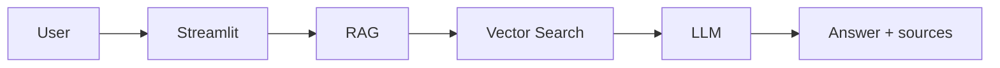
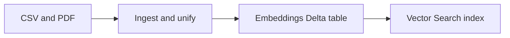

# Ayurvedic Health Assistant (AyurGenix)

**Ayurvedic Health Assistant** is a learning companion for Ayurvedic wellness. You can ask about mind–body balance, daily and seasonal routines, diet, sleep, digestion, and classical ideas such as doshas and prakriti. The assistant answers in clear language from **curated Ayurvedic CSV and PDF** content using **retrieval-augmented generation (RAG)** on Databricks (Vector Search + a chat LLM), with an optional **offline rule-based** tab when you want a quick demo without the workspace.

It is meant for **curiosity and study**, not for diagnosing or treating disease. This is **not medical advice** and does not replace a qualified health professional.

> **Educational use only.** Consult a qualified clinician for personal health decisions.

---

## Architecture

High level: **Streamlit** asks a **RAG** layer (in-process or HTTP), which uses **Databricks Vector Search** and a **chat LLM**. Separately, **raw files** are ingested into **Delta**, embedded, and synced into that index.

### Runtime — one question

The RAG layer is either **`app/backend/rag_core.py`** (Direct, same process) or **`app/backend/api_client.py`** → **`rag_pipeline/06_api_serving.py`** (Remote). Both paths embed the question, retrieve from **Vector Search**, then call the **LLM**; the app also does **language detection** / **response language** (`rag_core`, `rag_pipeline/language_utils.py`).



### Batch — building the index

**UC volume** + **`ayurgenixai_ingestion/`** notebooks produce **`processed_knowledge_base`**. **`rag_pipeline/02_generate_embeddings.py`** writes **`knowledge_base_embeddings`**; **`03_create_vector_index.py`** syncs that table into the **Vector Search** index. (Optional **`knowledge_base`** via **`06_save_as_delta.py`**; run **05** before **02**.)



At query time the RAG layer reads **IDX** (with optional **CSV vs PDF** filter) and grounds the **LLM** on retrieved chunks.

### Demo video

A short narrative of **what the project does** and **how Databricks is used** (no runbook) is in [`demo-video-script.md`](demo-video-script.md).

---

## Prerequisites (Databricks)

- Databricks workspace with **Unity Catalog** enabled.
- **Model Serving** endpoints for:
  - Embeddings (default name in code: `databricks-gte-large-en`).
  - Chat LLM (default: `databricks-meta-llama-3-3-70b-instruct`).
- Permissions for the app’s identity to query those endpoints and the **Vector Search** endpoint/index.
- Repo or workspace copy of this project; notebooks under `databricks_notebooks/`.

---

## How to run

### 1) Upload sample data to the volume

After notebook **`01_setup_catalog_and_volume.py`** has created the catalog, schema, and volume, copy the contents of this repo’s `raw_data/` folder into the volume path expected by the notebooks (default):

`/Volumes/<CATALOG>/<SCHEMA>/files/raw_data/`

Example (adjust catalog/schema if you changed them in the notebooks):

```text
/Volumes/bricksiitm/ayurgenix/files/raw_data/
```

Use **Catalog Explorer** → your volume → **Upload**, or `databricks fs cp` / DBFS–volume workflows your admin recommends.

### 2) Run pipeline notebooks (order)

In the Databricks workspace, open the repo (e.g. **Repos**) and run cells **top to bottom** in this order. **Edit `CATALOG`, `SCHEMA`, volume paths, and serving endpoint names** at the top of each notebook to match your environment.

| Step | Notebook | Purpose |
|------|----------|---------|
| 1 | `databricks_notebooks/ayurgenixai_ingestion/01_setup_catalog_and_volume.py` | Unity Catalog catalog, schema, volume |
| 2 | `databricks_notebooks/ayurgenixai_ingestion/02_validate_raw_files.py` | Validate files under `raw_data/` |
| 3 | `databricks_notebooks/ayurgenixai_ingestion/03_ingest_csv.py` | CSV → staging Delta |
| 4 | `databricks_notebooks/ayurgenixai_ingestion/04_ingest_pdfs.py` | PDFs → staging Delta |
| 5 | `databricks_notebooks/ayurgenixai_ingestion/05_unify_data.py` | Build **`processed_knowledge_base`** (required before embeddings) |
| 6 | `databricks_notebooks/ayurgenixai_ingestion/06_save_as_delta.py` | Materialize **`knowledge_base`** Delta (from processed or staging) |
| 7 | `databricks_notebooks/ayurgenixai_ingestion/07_validate_and_query.py` | Sanity checks |
| 8 | `databricks_notebooks/rag_pipeline/02_generate_embeddings.py` | Embeddings → **`knowledge_base_embeddings`** |
| 9 | `databricks_notebooks/rag_pipeline/03_create_vector_index.py` | Vector Search endpoint + **Delta Sync** index |
| 10 | `databricks_notebooks/rag_pipeline/04_retrieval_pipeline.py` | Test retrieval |
| 11 | `databricks_notebooks/rag_pipeline/05_rag_pipeline.py` | Test full RAG in a notebook |
| 12 | `databricks_notebooks/rag_pipeline/06_api_serving.py` | Optional FastAPI-style service (for **Remote API** mode in Streamlit) |

Optional: `databricks_notebooks/ayurgenixai_preprocessing/01_preprocessing_pipeline.ipynb` for an alternate notebook-based cleaning path if you extend the pipeline.

**Important:** `rag_pipeline/02_generate_embeddings.py` reads **`processed_knowledge_base`**. Ensure step **5** completed successfully before step **8**.

---

### 3) Run the Streamlit app locally (outside Databricks)

From the **repository root**:

```bash
python -m venv .venv
source .venv/bin/activate
pip install -r requirements.txt
streamlit run app/app.py
```

Open the URL Streamlit prints (usually `http://localhost:8501`).

For **Direct** mode (in-process RAG), set Databricks auth in the environment (same as SDK), for example:

```bash
export DATABRICKS_HOST="https://<workspace-host>"
export DATABRICKS_TOKEN="<personal-access-token-or-pat>"
```

Optional overrides (if your catalog, schema, or endpoint names differ from defaults in `app/backend/rag_core.py`):

```bash
export AYURGENIX_CATALOG="your_catalog"
export AYURGENIX_SCHEMA="your_schema"
export AYURGENIX_VECTOR_ENDPOINT="your-vector-search-endpoint"
export AYURGENIX_VECTOR_INDEX="your_catalog.your_schema.your_index_name"
export AYURGENIX_EMBEDDING_ENDPOINT="your-embedding-endpoint"
export AYURGENIX_LLM_ENDPOINT="your-llm-endpoint"
```

For **Remote API** mode, you can preset the Streamlit sidebar defaults:

```bash
export AYURGENIX_API_URL="https://your-fastapi-host.example.com"
export AYURGENIX_API_TOKEN=""   # optional Bearer token if your API requires it
```

---

### 4) Deploy the Streamlit app on **Databricks Apps**

1. Ensure **`app/app.yaml`** and **`app/requirements.txt`** are present (same folder as **`app/app.py`**). The repo’s root `requirements.txt` includes `-r app/requirements.txt` for local installs.
2. In Databricks: **Compute** → **Apps** → **Create app** (wording may vary slightly by UI version).
3. Set the **source** to the **`app/`** directory of this project (e.g. Repos path like `/Workspace/Repos/<user>/ayurvedic-health-assistant/app`).
4. Assign an **identity** (service principal or user) that can call **Vector Search** and both **serving endpoints**.
5. Under app **environment variables**, set the same optional `AYURGENIX_*` RAG variables as in local run if you are not using the defaults in `rag_core.py`. For **Remote API** as the default sidebar choice, also set `AYURGENIX_API_URL` (and `AYURGENIX_API_TOKEN` if required).
6. Deploy and open the **App URL** Databricks provides.

**Recommended mode in production:** sidebar **Backend** → **Direct (in-process)** so Streamlit uses `rag_core` with the app runtime’s credentials (no separate FastAPI host required).

---

## Demo steps (what to click)

### Live RAG (Databricks-backed)

1. Open the app (local Streamlit URL or **Databricks App** URL).
2. In the **sidebar**, under **Backend**, choose **Direct (in-process)** if available (requires `databricks-sdk` / `databricks-vectorsearch` and workspace auth). Otherwise choose **Remote API (HTTP)**, enter the base URL from running notebook **`06_api_serving.py`**, optional **Bearer token**, and **Check connection** if shown.
3. Click the main tab **Ask AyurGenix (live RAG)**.
4. Optionally adjust **Top-K passages** or **Source filter** (All vs **CSV (herb monographs)** vs **PDF (textbooks)**) in the sidebar.
5. Either:
   - Click an example chip (**English**, **Hindi**, **Telugu**, etc.) under *Try an example*, or  
   - Type your own question in **Your question** (e.g. `How does Ayurveda recommend improving sleep quality?`).
6. Optionally change **Response language** (e.g. **Auto-detect** or a specific language).
7. Click **Ask** and wait for the answer.
8. Expand **Sources (N)** under the answer to inspect retrieved chunks.

### Offline quick demo (no Databricks)

1. Open the tab **Quick demo (offline)**.
2. Under **Try an example**, pick a radio option *or* type symptoms in **Symptoms**.
3. Click **Analyze** to see the rule-based matcher output.

---

## Repository layout

```text
app/                            # Streamlit UI (Databricks Apps entry)
  app.py
  app.yaml
  requirements.txt              # app deps; root requirements.txt pulls this in
  backend/
    rag_core.py                 # In-process RAG (Direct mode)
    api_client.py               # HTTP client for Remote API mode
    test_match.py               # Offline rule-based demo
databricks_notebooks/
  ayurgenixai_ingestion/        # UC volume, ingest, unify, Delta
  ayurgenixai_preprocessing/    # Optional preprocessing notebook
  rag_pipeline/
    language_utils.py           # Shared language detect / resolve (with rag_core)
    02_generate_embeddings.py   # processed_knowledge_base → knowledge_base_embeddings
    03_create_vector_index.py   # Vector Search index
    04_retrieval_pipeline.py    # Retrieval tests
    05_rag_pipeline.py          # End-to-end RAG tests in a notebook
    06_api_serving.py           # FastAPI for Remote API mode
raw_data/                       # Sample CSV + PDFs for the volume
```

---

## Troubleshooting

- **Direct mode unavailable** in the UI: install dependencies with `pip install -r requirements.txt` and ensure `DATABRICKS_HOST` / `DATABRICKS_TOKEN` (or Apps identity) are valid.
- **Empty retrieval / errors from Vector Search**: confirm notebook **`03_create_vector_index.py`** finished, CDF is enabled on the embeddings table, and index/endpoint names match `AYURGENIX_*` (or defaults in `rag_core.py`).
- **Embedding step fails**: verify the embedding **serving endpoint** name matches `EMBEDDING_ENDPOINT` in `02_generate_embeddings.py` and that the identity can invoke it.
